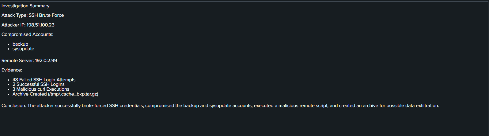
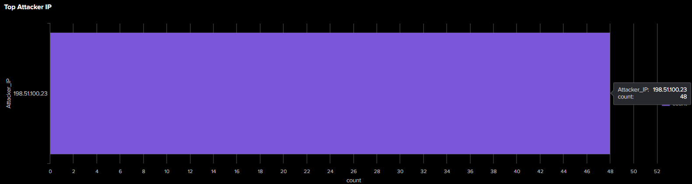

# 🛡️ SOC Incident Response Dashboard using Splunk


A Splunk-based **SOC Incident Response Dashboard** developed to monitor authentication logs, detect SSH brute-force attacks, identify suspicious command execution, and assist security analysts in incident investigation using **MITRE ATT&CK** techniques.

---

# 📑 Table of Contents

- Project Overview
- Features
- Dashboard Preview
- Detection Logic
- MITRE ATT&CK Mapping
- Technologies Used
- Repository Structure
- Skills Demonstrated
- Future Improvements
- Author

---

# 📌 Project Overview

This project simulates the workflow of a Security Operations Center (SOC) analyst by collecting and analyzing security events from authentication logs. Using Splunk dashboards and SPL queries, the project helps identify suspicious login attempts, detect malicious activity, correlate security events, and document incident findings.

---

# ✨ Features

- Failed Login Detection
- Successful Login Monitoring
- Authentication Correlation
- Top Attacker IP Detection
- Top Targeted User Accounts
- Incident Timeline
- Suspicious File Download Detection
- Indicators of Compromise (IOC)
- MITRE ATT&CK Mapping
- Analyst Investigation Summary

---

# 📊 Dashboard Preview

## Complete Dashboard


---

## Authentication Correlation

Displays failed and successful authentication attempts over time to help identify brute-force attacks.


---

## MITRE ATT&CK Mapping

Maps detected attack techniques to the MITRE ATT&CK Framework.


---

## Incident Summary

Provides an overview of attacker IP, severity, compromised accounts, and investigation findings.



---

## Top Attacker IP

Displays the source IP responsible for the highest number of failed authentication attempts.



---

# 🔍 Detection Logic

The dashboard detects and monitors:

- SSH Brute Force Attempts
- Successful Login After Multiple Failures
- Suspicious `curl` Downloads
- Archive File Downloads (`cache_bkp.tar.gz`)
- Potential Account Compromise
- Authentication Anomalies
- Suspicious Command Execution

---

# 🎯 MITRE ATT&CK Mapping

| Technique ID | Technique |
|--------------|-------------------------------|
| T1110 | Brute Force |
| T1059 | Command and Scripting Interpreter |
| T1560 | Archive Collected Data |

---

# 🛠️ Technologies Used

- Splunk Enterprise
- Search Processing Language (SPL)
- Linux Authentication Logs
- Kali Linux
- Ubuntu
- MITRE ATT&CK Framework

---

# 📂 Repository Structure

```text
SOC-Incident-Response-Dashboard
│
├── Dashboard
│   └── SOC Incident Response Dashboard.pdf
│
├── Screenshots
│   ├── dashboard-overview.png
│   ├── authentication-correlation.png
│   ├── attacker-ip.png
│   ├── incident-summary.png
│   └── mitre-mapping.png
│
├── SPL-Queries
│   ├── failed-login.spl
│   ├── successful-login.spl
│   ├── authentication-correlation.spl
│   ├── attacker-ip.spl
│   ├── top-users.spl
│   ├── incident-summary.spl
│   ├── suspicious-download.spl
│   ├── incident-timeline.spl
│   └── mitre-mapping.spl
│
├── Sample-Logs
│   └── sample_logs.txt
│
├── Documentation
│   └── dashboard-description.md
│
├── LICENSE
└── README.md
```

---

# 💡 Skills Demonstrated

- Security Monitoring
- Log Analysis
- Splunk Dashboard Development
- Search Processing Language (SPL)
- Threat Hunting
- Incident Response
- IOC Identification
- MITRE ATT&CK Mapping
- Authentication Monitoring
- Security Event Correlation

---

# 🚀 Future Improvements

- Real-time alert generation
- Email notifications
- Geo-location mapping of attacker IPs
- Risk scoring dashboard
- Threat intelligence integration
- SOAR automation
- Machine learning-based anomaly detection

---

# 👩‍💻 Author

**Shrishti Pandey**

Cybersecurity Enthusiast | SOC Analyst Aspirant

