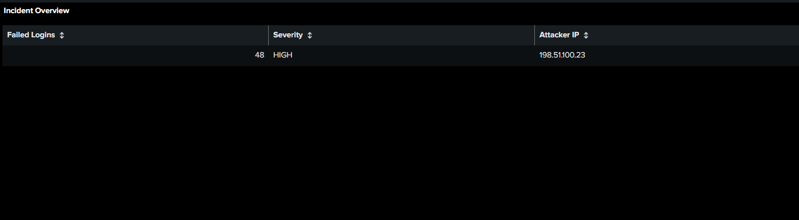
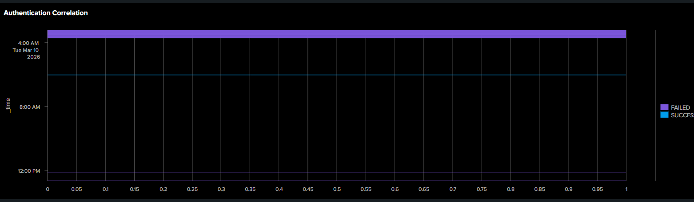
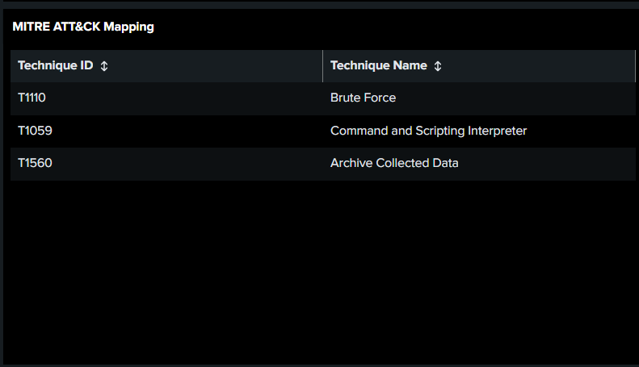

# SOC Incident Response Dashboard

## Overview

This project demonstrates a Splunk-based SOC Incident Response Dashboard designed to detect and investigate SSH brute-force attacks and suspicious command execution.

---

## Features

- Failed Login Detection
- Successful Login Monitoring
- Authentication Correlation
- Top Attacker IPs
- Top Targeted Users
- MITRE ATT&CK Mapping
- Incident Timeline
- IOC Detection
- Analyst Investigation Summary

---

## Technologies Used

- Splunk Enterprise
- SPL (Search Processing Language)
- Kali Linux
- Ubuntu
- MITRE ATT&CK Framework

---

## Authentication Correlation

## MITRE ATT&CK Techniques

- T1110 – Brute Force
- T1059 – Command and Scripting Interpreter
- T1560 – Archive Collected Data
  

---

## Skills Demonstrated

- Log Analysis
- Threat Hunting
- Incident Response
- Splunk Dashboard Development
- Security Monitoring

---

## Author

Shrishti Pandey
